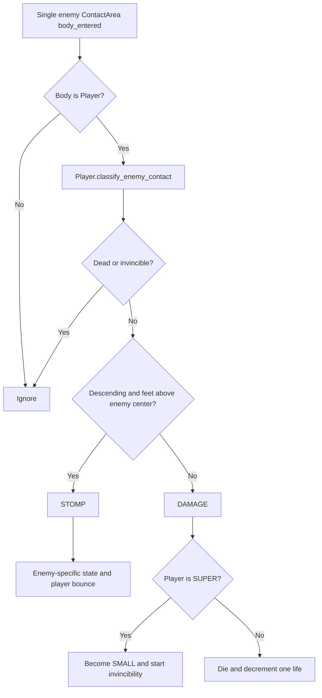

# Flowchart: #14 Player/enemy contact resolution

```mermaid
flowchart TD
    A[Single enemy ContactArea body_entered] --> B{Body is Player?}
    B -->|No| Z[Ignore]
    B -->|Yes| C[Player.classify_enemy_contact]
    C --> D{Dead or invincible?}
    D -->|Yes| Z
    D -->|No| E{Descending and feet above enemy center?}
    E -->|Yes| F[STOMP]
    E -->|No| G[DAMAGE]
    F --> H[Enemy-specific state and player bounce]
    G --> I{Player is SUPER?}
    I -->|Yes| J[Become SMALL and start invincibility]
    I -->|No| K[Die and decrement one life]
```
