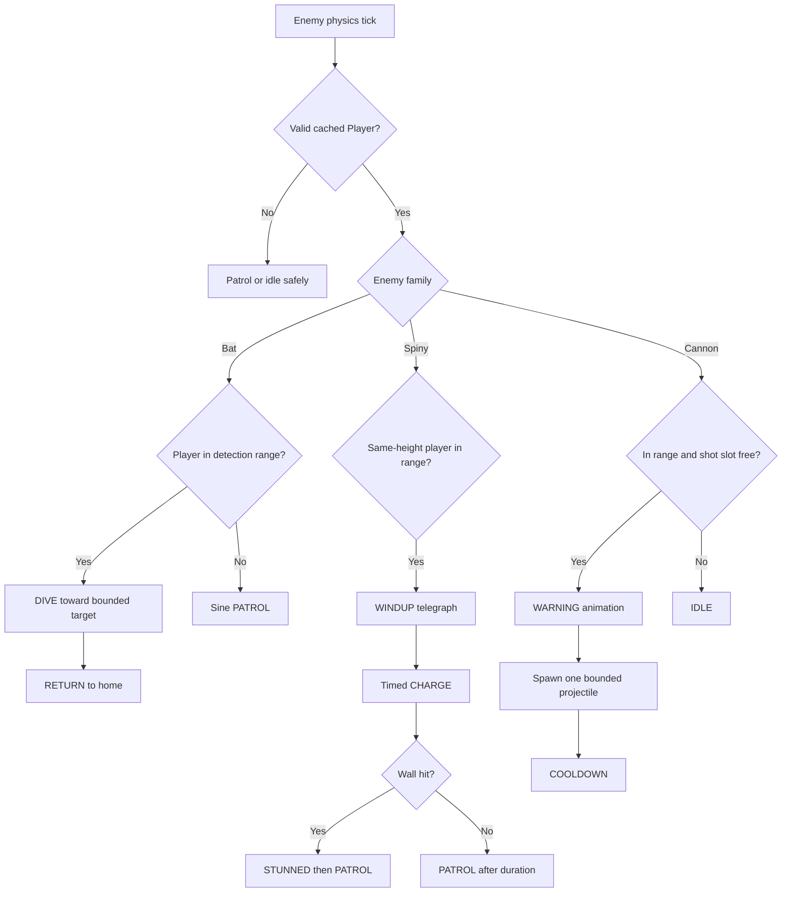

# Flowchart: #16 Enemy behavior selection

```mermaid
flowchart TD
    A[Enemy physics tick] --> B{Valid cached Player?}
    B -->|No| C[Patrol or idle safely]
    B -->|Yes| D{Enemy family}
    D -->|Bat| E{Player in detection range?}
    E -->|Yes| F[DIVE toward bounded target]
    F --> G[RETURN to home]
    E -->|No| H[Sine PATROL]
    D -->|Spiny| I{Same-height player in range?}
    I -->|Yes| J[WINDUP telegraph]
    J --> K[Timed CHARGE]
    K --> L{Wall hit?}
    L -->|Yes| M[STUNNED then PATROL]
    L -->|No| N[PATROL after duration]
    D -->|Cannon| O{In range and shot slot free?}
    O -->|Yes| P[WARNING animation]
    P --> Q[Spawn one bounded projectile]
    Q --> R[COOLDOWN]
    O -->|No| S[IDLE]
```
