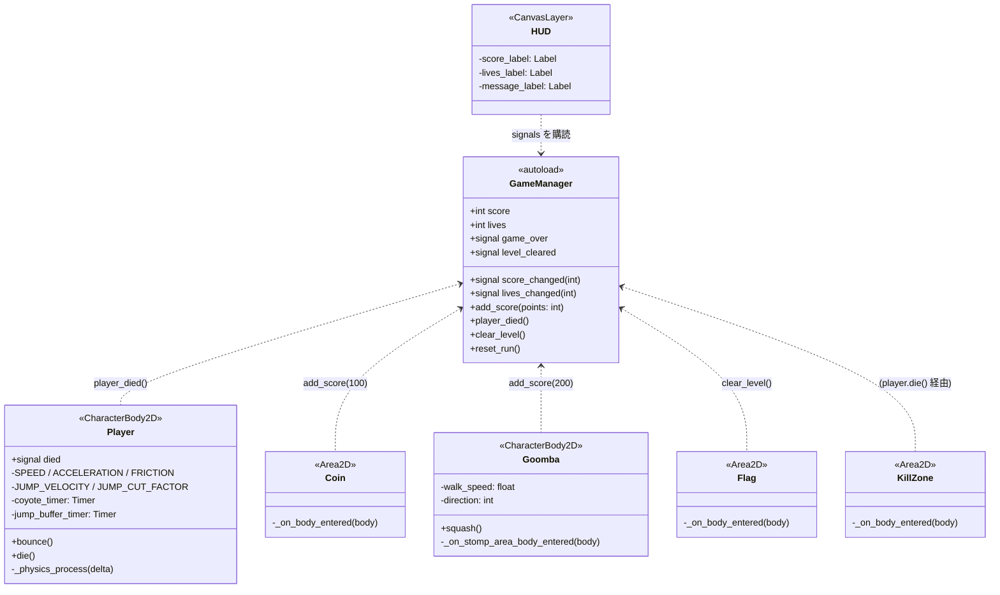
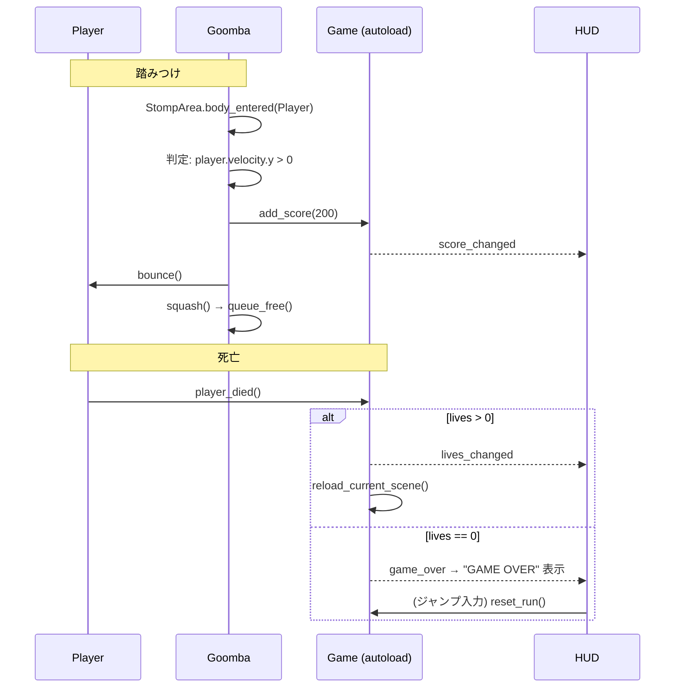

# Design: 2Dマリオ風プラットフォーマー + godot-mcp ワークフロー統合 (#3)

- Issue: https://github.com/TE-ToshiakiTanaka2/clown/issues/3
- 設計担当: Claude Fable 5(本文書)
- 実装担当: Claude Sonnet 5(サブエージェント)
- レビュー担当: Codex CLI / `gpt-5.6-sol`(`.codex/config.toml`)
- 対象エンジン: Godot 4.7(headless 実行可能であること)

## 1. ゴール

`game/` プロジェクトに、最小だが「遊べる」2Dマリオ風プラットフォーマーを実装する。
グラフィックはプレースホルダー(単色スプライト)とし、後からアセット差し替えできる構造を保つ。

スコープ外: 音声、複数レベル、パワーアップ(キノコ等)、セーブデータ。

## 2. ディレクトリ構成

```
game/
├── project.godot          # 入力マップ・物理レイヤー名・autoload を追記
├── main.tscn              # 既存。Level1 をインスタンスするエントリポイント
├── scenes/
│   ├── level_1.tscn       # 地形(TileMapLayer)+ 配置済みエンティティ
│   ├── player.tscn
│   ├── goomba.tscn
│   ├── coin.tscn
│   ├── flag.tscn          # ゴール
│   └── hud.tscn           # CanvasLayer
└── scripts/
    ├── game_manager.gd    # autoload シングルトン
    ├── player.gd
    ├── goomba.gd
    ├── coin.gd
    ├── flag.gd
    ├── kill_zone.gd       # 落下死ゾーン
    └── hud.gd
```

すべての `.tscn` はテキスト形式で作成し、godot-mcp または直接編集で生成する。

## 3. 物理レイヤー設計

`project.godot` の `layer_names/2d_physics` に名前を付ける。

| Layer | 名前        | 用途                             |
|-------|-------------|----------------------------------|
| 1     | world       | 地形 (TileMapLayer の衝突)        |
| 2     | player      | プレイヤー本体                   |
| 3     | enemy       | 敵本体                           |
| 4     | pickup      | コイン・旗・キルゾーン (Area2D)   |

- Player body: layer=2, mask=1|3(地形と敵に衝突)
- Goomba body: layer=3, mask=1|2
- Coin/Flag/KillZone (Area2D): layer=4, mask=2(プレイヤーのみ検知)
- Goomba の StompArea (Area2D): 敵の頭上に配置、mask=2

## 4. クラス設計



### 4.1 GameManager (autoload `Game`)

- `score: int`, `lives: int = 3` を保持。
- `player_died()`: `lives -= 1`。`lives > 0` なら現在シーンをリロード、`0` なら `game_over` を emit。
- `clear_level()`: `level_cleared` を emit し、入力を止める(`get_tree().paused = true` は使わず、Player 側で `set_physics_process(false)`)。
- `reset_run()`: game over 後にスコア・残機を初期化してシーンをリロード(ジャンプキーで再開)。
- シーンリロード後も autoload なのでスコア・残機は維持される。

### 4.2 Player

typed GDScript。物理パラメータは `@export` でチューニング可能にする。

- 水平: `move_toward` による加速/摩擦。
- 重力: `ProjectSettings.get_setting("physics/2d/default_gravity")` を使用。
- **可変ジャンプ**: ジャンプキー解放時に `velocity.y *= JUMP_CUT_FACTOR`(上昇中のみ)。
- **コヨーテタイム** (0.1s): `is_on_floor()` から離れた直後もジャンプ許可。
- **ジャンプバッファ** (0.1s): 着地直前のジャンプ入力を保持。
- `bounce()`: 敵を踏んだ時に呼ばれ、`velocity.y = JUMP_VELOCITY * 0.7`。
- `die()`: 二重死亡ガード付き。`died` emit → `Game.player_died()`。
- 敵本体との接触判定は Player 側の Hazard 検知ではなく、**Goomba 側の判定**(§4.3)に寄せ、責務を一箇所にする。

### 4.3 Goomba

- `_physics_process`: `velocity.x = direction * walk_speed`、壁 (`is_on_wall()`) と崖(前方下向き `RayCast2D` が床を検知しない)で反転。
- 頭上の `StompArea`(Area2D)に Player が入り、かつ Player が落下中 (`velocity.y > 0`) → `squash()`: スコア加算(200)、`player.bounce()`、当たり判定を無効化して `queue_free()`。
- 本体との横接触(`move_and_slide` 後の `get_slide_collision` で Player を検知、または Player 側 mask=3 の衝突)→ `player.die()`。
  実装単純化のため: Goomba に本体用 `HitArea`(Area2D, mask=2)を持たせ、`body_entered` で「踏み条件を満たさない接触」なら `player.die()` とする。StompArea と HitArea の競合は「Player が落下中かつ Player の足が Goomba の中心より上」を踏み判定とすることで解決する。

### 4.4 Coin / Flag / KillZone

- いずれも `Area2D.body_entered(body)` で `body is Player` を型チェックしてから作用。
- Coin: `Game.add_score(100)` → `queue_free()`。
- Flag: `Game.clear_level()`。
- KillZone: `player.die()`(スコア減点なし、残機減)。

### 4.5 HUD

- `Game.score_changed / lives_changed / game_over / level_cleared` を `_ready()` で connect。
- 中央メッセージ: 死亡時は不要、`GAME OVER`(+ "Press Jump to Retry")と `COURSE CLEAR!` のみ。
- game over 中にジャンプ入力で `Game.reset_run()`(HUD の `_unhandled_input` で処理)。

## 5. シーン構成

### 5.1 player.tscn

```
Player (CharacterBody2D) [player.gd]
├── Sprite2D          # PlaceholderTexture2D 24x32, modulate 赤
├── CollisionShape2D  # RectangleShape2D 20x30
├── CoyoteTimer (Timer, one_shot)
└── JumpBufferTimer (Timer, one_shot)
```

### 5.2 goomba.tscn

```
Goomba (CharacterBody2D) [goomba.gd]
├── Sprite2D          # PlaceholderTexture2D 24x24, modulate 茶
├── CollisionShape2D  # RectangleShape2D 22x22
├── FloorRay (RayCast2D)   # 前方下向き、崖検知
├── StompArea (Area2D)     # 頭上 24x8
│   └── CollisionShape2D
└── HitArea (Area2D)       # 本体 22x18(下寄り)
    └── CollisionShape2D
```

### 5.3 level_1.tscn

```
Level1 (Node2D)
├── Terrain (TileMapLayer)   # 16px タイル、physics 付き TileSet 内蔵
├── Player (instance)
├── Enemies (Node2D) ── Goomba ×3
├── Coins (Node2D) ── Coin ×8
├── Flag (instance)          # レベル終端
├── KillZone (Area2D + WorldBoundaryShape2D) # y > 床下
├── HUD (instance)
└── Camera2D は Player 側に持たせる(limit_left/bottom 設定)
```

レベルは横スクロール 1 面(幅 ~200 タイル)。地面・段差・穴(2〜4 タイル幅)・ブロックの足場を配置。
TileSet はスクリプト不要のインラインリソース(単色 `PlaceholderTexture2D` + `TileSetAtlasSource` 1 タイル + 矩形 physics polygon)。

### 5.4 main.tscn

既存 `main.tscn` を「Level1 をインスタンスするだけ」に更新(将来のレベル切替ポイント)。

## 6. 主要シーケンス



## 7. project.godot への追記

- `[application]` `config/description`、autoload: `Game="*res://scripts/game_manager.gd"`
- `[input]`: `move_left` (A, ←)、`move_right` (D, →)、`jump` (Space, W, ↑)
- `[layer_names]`: §3 の 2D physics layer 名
- `[display]`: `window/size/viewport_width=640`, `viewport_height=360`, `window/stretch/mode="canvas_items"`
- `[rendering]`: `textures/canvas_textures/default_texture_filter=0`(ピクセルアート向けニアレスト)

## 8. godot-mcp ワークフロー統合

godot-mcp は Claude Code(`.mcp.json`)と Codex(`.codex/config.toml`)の双方に登録済み。
本 Issue で以下をワークフロー文書に明文化する。

| フェーズ | godot-mcp の利用 |
|----------|------------------|
| design   | `get_project_info` / `get_godot_version` で実プロジェクト状態を設計の前提にする |
| implement| `create_scene` / `add_node` / `save_scene` によるシーン生成、`run_project` + `get_debug_output` + `stop_project` による実行検証。MCP が失敗する場合は `godot --headless --path game` へフォールバック |
| review   | レビュアー(Codex)は `run_project` / `get_debug_output` で headless 起動検証を行い、静的読解のみのレビューを避ける |

変更対象: `.tarnished/workflows/design.md`, `implement.md`, `review.md`, `AGENTS.md`。
(`.tarnished/workflows/erd/` と `.claude/skills/` は upstream refresh 管理のため変更しない。)

## 9. 検証計画

1. `godot --headless --path game --import`(リソースインポート)がエラーなく完了する。
2. `godot --headless --path game --quit-after 120`(数秒実行して終了)で script error / parse error が出ない。
3. godot-mcp `run_project` → `get_debug_output` でランタイムエラーがないことを確認。
4. GDScript 静的チェック: `godot --headless --path game --check-only -s <script>` 相当が使えない場合は 2. のロードで代替。

## 10. リスクと対応

| リスク | 対応 |
|--------|------|
| headless で描画確認不可 | デバッグ出力・シーンツリー検証で代替。ロジックはシグナル駆動で目視非依存に |
| .tscn 手書きの ExtResource/SubResource ID 破損 | 2. のロード検証を各シーン追加ごとに実施 |
| 踏み判定と接触死の競合 | §4.3 の「落下中 + 足位置」条件に一本化 |
| TileSet physics 設定漏れ | 検証手順 2 で `is_on_floor()` が機能しない場合に最初に疑う箇所として workflow.md に明記 |
