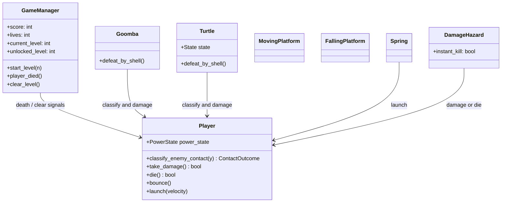

# Class Diagram (Project-wide)

```mermaid
classDiagram
    class GameManager {
        +score: int
        +lives: int
        +current_level: int
        +unlocked_level: int
        +start_level(n)
        +player_died()
        +clear_level()
    }
    class Player {
        +PowerState power_state
        +classify_enemy_contact(y) ContactOutcome
        +take_damage() bool
        +die() bool
        +bounce()
        +launch(velocity)
    }
    class Goomba {
        +defeat_by_shell()
    }
    class Turtle {
        +State state
        +defeat_by_shell()
    }
    class MovingPlatform
    class FallingPlatform
    class Spring
    class DamageHazard {
        +instant_kill: bool
    }
    GameManager --> Player : death / clear signals
    Goomba --> Player : classify and damage
    Turtle --> Player : classify and damage
    Spring --> Player : launch
    DamageHazard --> Player : damage or die
```
