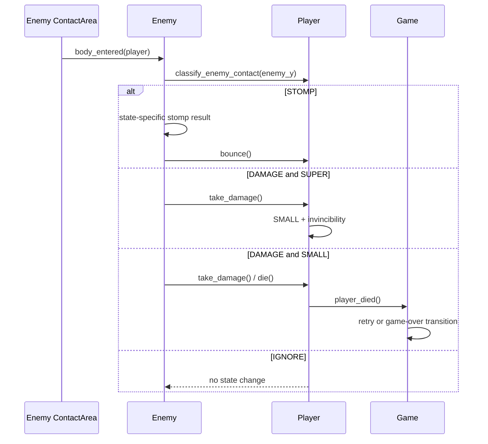
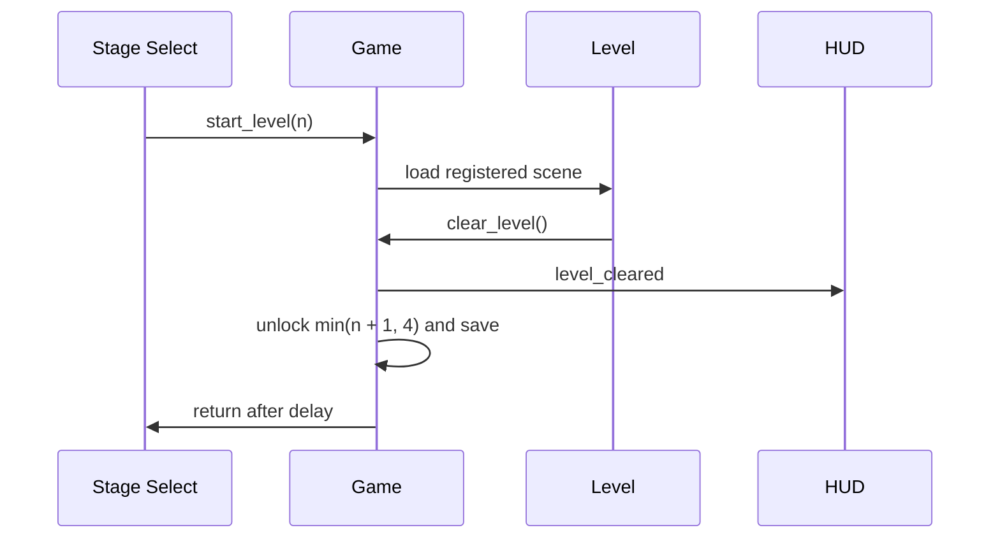

# Sequence Diagram (System-wide)

## Player and enemy contact

```mermaid
sequenceDiagram
    participant Area as Enemy ContactArea
    participant Enemy
    participant Player
    participant Game
    Area->>Enemy: body_entered(player)
    Enemy->>Player: classify_enemy_contact(enemy_y)
    alt STOMP
        Enemy->>Enemy: state-specific stomp result
        Enemy->>Player: bounce()
    else DAMAGE and SUPER
        Enemy->>Player: take_damage()
        Player->>Player: SMALL + invincibility
    else DAMAGE and SMALL
        Enemy->>Player: take_damage() / die()
        Player->>Game: player_died()
        Game->>Game: retry or game-over transition
    else IGNORE
        Player-->>Enemy: no state change
    end
```

## Four-stage progression

```mermaid
sequenceDiagram
    participant Select as Stage Select
    participant Game
    participant Level
    participant HUD
    Select->>Game: start_level(n)
    Game->>Level: load registered scene
    Level->>Game: clear_level()
    Game->>HUD: level_cleared
    Game->>Game: unlock min(n + 1, 4) and save
    Game->>Select: return after delay
```
