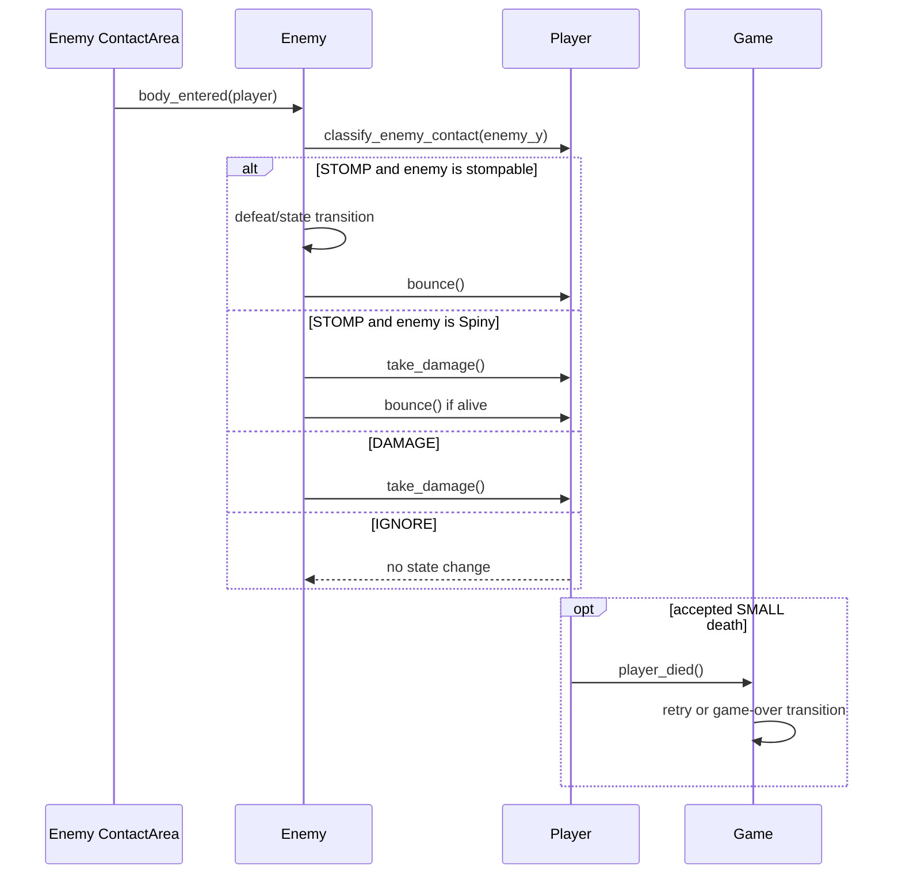
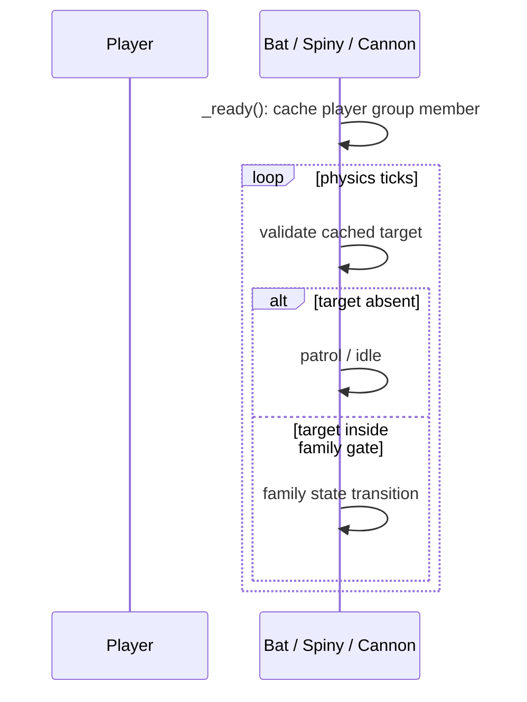
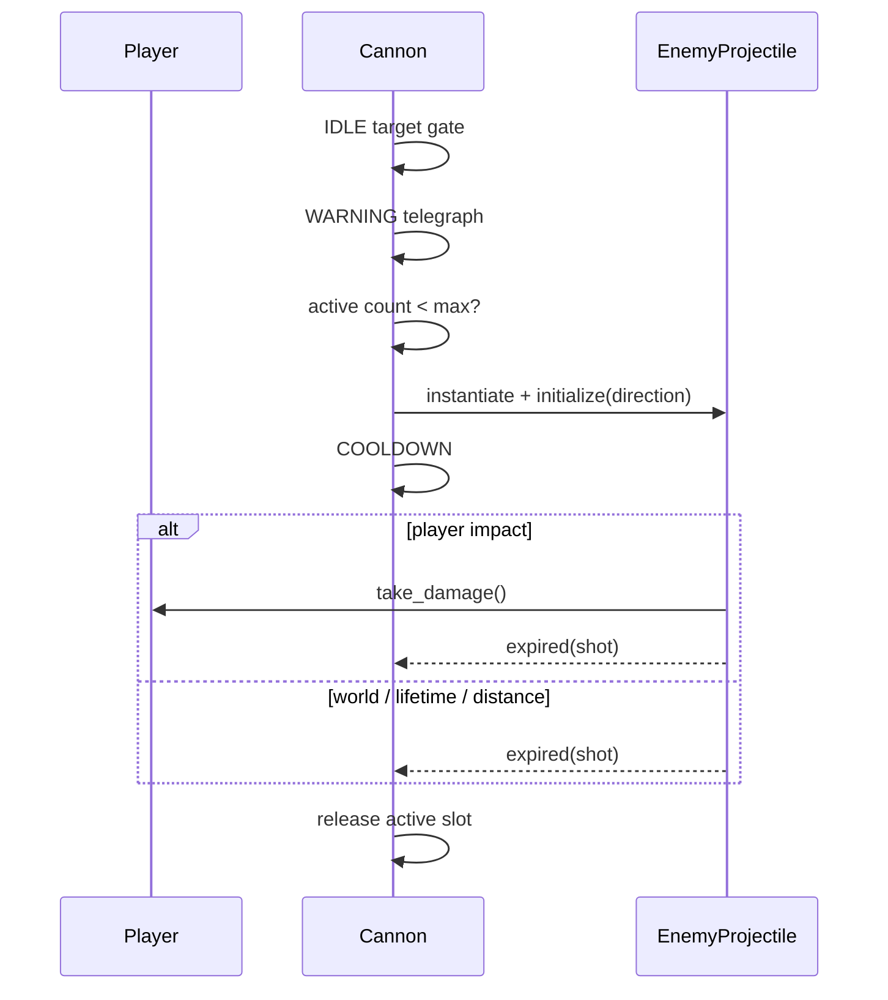
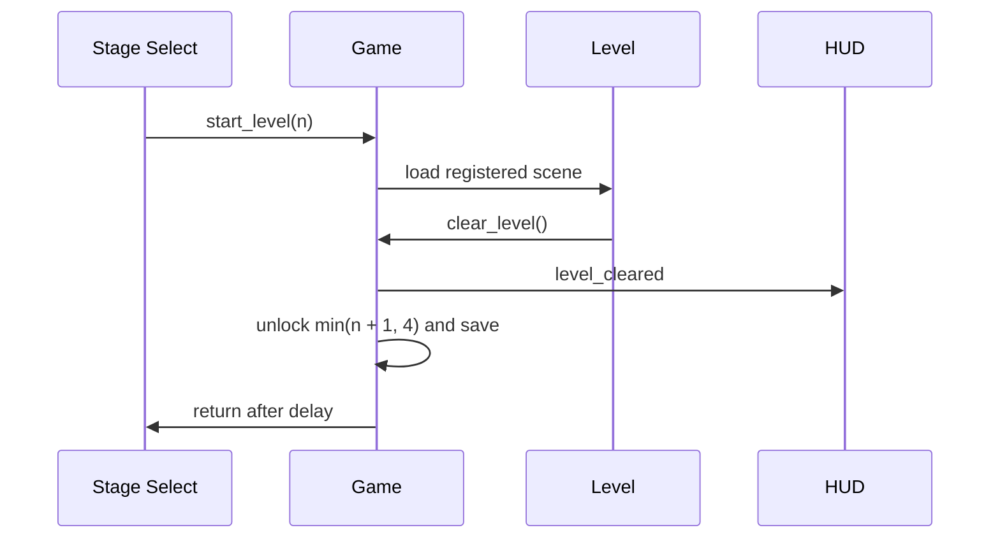

# Sequence Diagram (System-wide)

## Player and enemy contact

```mermaid
sequenceDiagram
    participant Area as Enemy ContactArea
    participant Enemy
    participant Player
    participant Game
    Area->>Enemy: body_entered(player)
    Enemy->>Player: classify_enemy_contact(enemy_y)
    alt STOMP and enemy is stompable
        Enemy->>Enemy: defeat/state transition
        Enemy->>Player: bounce()
    else STOMP and enemy is Spiny
        Enemy->>Player: take_damage()
        Enemy->>Player: bounce() if alive
    else DAMAGE
        Enemy->>Player: take_damage()
    else IGNORE
        Player-->>Enemy: no state change
    end
    opt accepted SMALL death
        Player->>Game: player_died()
        Game->>Game: retry or game-over transition
    end
```

## Targeted enemy AI

```mermaid
sequenceDiagram
    participant Player
    participant Enemy as Bat / Spiny / Cannon
    Enemy->>Enemy: _ready(): cache player group member
    loop physics ticks
        Enemy->>Enemy: validate cached target
        alt target absent
            Enemy->>Enemy: patrol / idle
        else target inside family gate
            Enemy->>Enemy: family state transition
        end
    end
```

## Cannon projectile lifecycle

```mermaid
sequenceDiagram
    participant Player
    participant Cannon
    participant Shot as EnemyProjectile
    Cannon->>Cannon: IDLE target gate
    Cannon->>Cannon: WARNING telegraph
    Cannon->>Cannon: active count < max?
    Cannon->>Shot: instantiate + initialize(direction)
    Cannon->>Cannon: COOLDOWN
    alt player impact
        Shot->>Player: take_damage()
        Shot-->>Cannon: expired(shot)
    else world / lifetime / distance
        Shot-->>Cannon: expired(shot)
    end
    Cannon->>Cannon: release active slot
```

## Four-stage progression

```mermaid
sequenceDiagram
    participant Select as Stage Select
    participant Game
    participant Level
    participant HUD
    Select->>Game: start_level(n)
    Game->>Level: load registered scene
    Level->>Game: clear_level()
    Game->>HUD: level_cleared
    Game->>Game: unlock min(n + 1, 4) and save
    Game->>Select: return after delay
```
